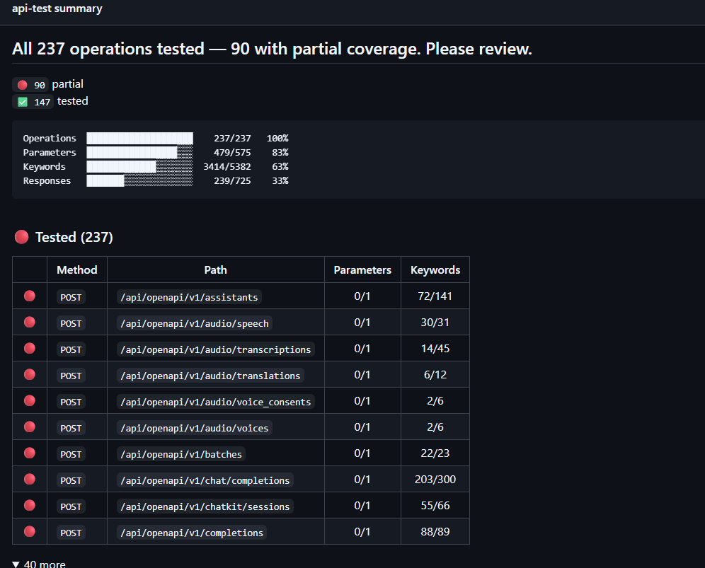
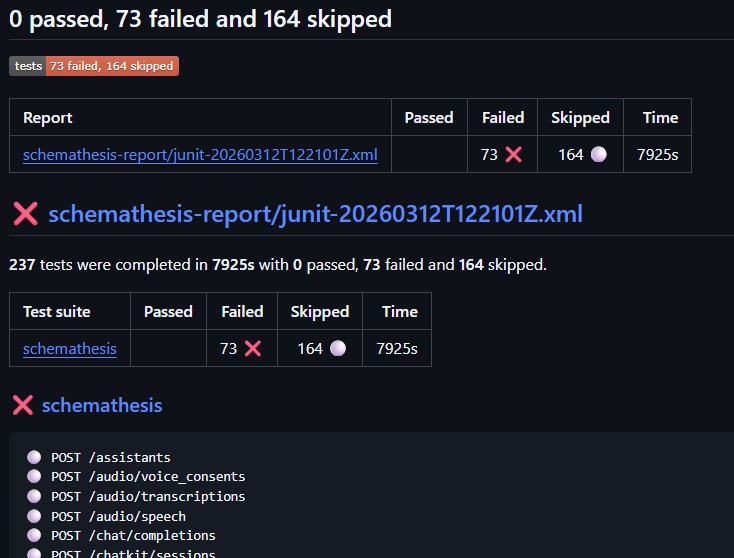

# Schemathesis GitHub Action

Run [Schemathesis](https://github.com/schemathesis/schemathesis) property-based tests against your OpenAPI or GraphQL API.

```yaml
- uses: schemathesis/action@v3
  with:
    # API schema location
    schema: 'https://example.schemathesis.io/openapi.json'
```

## Configuration

```yaml
- uses: schemathesis/action@v3
  with:
    # API schema location (URL or file path)
    schema: 'https://example.schemathesis.io/openapi.json'
    # Override the base URL from the schema
    base-url: 'https://example.schemathesis.io/v2/'
    # Checks to run (default: all)
    checks: 'not_a_server_error'
    # Seconds to wait for the schema to become available (default: 2)
    wait-for-schema: '30'
    # Test cases per API operation (default: 100)
    max-examples: 50
    # Schemathesis version (default: latest)
    version: 'latest'
    # Python module path for hooks
    hooks: 'tests.hooks'
    # Path to a `schemathesis.toml` configuration file
    config-file: 'tests/schemathesis.toml'
    # Authorization header value
    authorization: 'Bearer ${{ secrets.API_TOKEN }}'
    # Extra CLI arguments
    args: '--report=junit'
    # Track schema coverage (default: true)
    coverage: 'true'
    # Upload the HTML coverage report as an artifact (default: true)
    coverage-report: 'true'
    coverage-report-path: 'schema-coverage.html'
    coverage-artifact-name: 'schema-coverage-report'
    # Post the coverage summary as a PR comment (default: true)
    coverage-pr-comment: 'true'
    # Add the coverage summary to the job summary (default: true)
    coverage-step-summary: 'true'
```

`authorization` sets the full `Authorization` header, so any scheme works:

```yaml
    authorization: 'Basic ${{ secrets.ENCODED_CREDENTIALS }}'
```

`args` passes extra flags to `schemathesis run`. See the [CLI reference](https://schemathesis.readthedocs.io/en/stable/reference/cli/) for the full list.

## Coverage reports

[tracecov](https://tracecov.sh) measures how much of your schema the tests exercised. Coverage is on by default, and each run produces:

- a summary in the job summary
- an HTML report, uploaded as the `schema-coverage-report` artifact
- a PR comment with the summary, on `pull_request` and `pull_request_target` events

The action writes these reports even when Schemathesis finds failures.


The job summary looks like this:



For PR comments, grant the job `pull-requests: write`. Add `actions: read` so the comment can link to the HTML report artifact. A job-level `permissions` block drops every permission you don't list, so keep `contents: read` for `actions/checkout`:

```yaml
jobs:
  test:
    permissions:
      contents: read
      pull-requests: write
      actions: read
    steps:
      - uses: schemathesis/action@v3
        with:
          schema: 'http://example.com/api/openapi.json'
```

The action updates its own comment on each push instead of posting a new one. Without these permissions, or on pull requests from forks where the token is read-only, the action skips the comment and the step still passes.

To turn coverage off:

```yaml
    coverage: 'false'
```

### Running the action more than once

Each run uploads an artifact, and artifact names must be unique within a workflow run. Give each run its own name:

```yaml
- uses: schemathesis/action@v3
  with:
    schema: 'http://example.com/api/v1/openapi.json'
    coverage-artifact-name: 'coverage-v1'

- uses: schemathesis/action@v3
  with:
    schema: 'http://example.com/api/v2/openapi.json'
    coverage-artifact-name: 'coverage-v2'
```

Each artifact name gets its own PR comment, labelled with that name. Set `coverage-pr-comment: 'false'` on the runs whose comment you don't need. In a single job, set `coverage-step-summary: 'false'` on all but one run to keep the job summary readable.

## Test results in the job summary

With `--report=junit`, Schemathesis writes a JUnit XML file to `schemathesis-report/`. Publish it with [dorny/test-reporter](https://github.com/dorny/test-reporter):

```yaml
- uses: schemathesis/action@v3
  with:
    schema: 'http://example.com/api/openapi.json'
    args: '--report=junit'

- name: Publish test report
  uses: dorny/test-reporter@v2
  if: always()
  with:
    name: Schemathesis
    path: schemathesis-report/*.xml
    reporter: java-junit

- name: Upload test results
  uses: actions/upload-artifact@v7
  if: always()
  with:
    name: schemathesis-results
    path: schemathesis-report/
```

dorny/test-reporter needs `checks: write` permission. Both steps use `if: always()` because the action step fails when Schemathesis finds a problem.



## Resources

- [Documentation](https://schemathesis.readthedocs.io/en/stable/)
- [CLI Reference](https://schemathesis.readthedocs.io/en/stable/reference/cli/)
- [GitHub Issues](https://github.com/schemathesis/schemathesis/issues)
- [Discord](https://discord.gg/R9ASRAmHnA)
